# Living Next to a Factory Is Making You Sick — Or Is It?

> **Read the full illustrated analysis:** [petr-salomoun.github.io/posts/2026/05/08/tri-pollution-health-effect/](https://petr-salomoun.github.io/posts/2026/05/08/tri-pollution-health-effect/)

*An investigation of 11 years of US toxic pollution data — and what it really reveals about industry, poverty, race, and health*

---

## Section 1: The Mechanics — What We Analyzed

Every year, thousands of US industrial facilities — chemical plants, smelters, refineries, steel mills — are **legally required** to report how much of each toxic chemical they release into the air, water, and ground. This program, run by the EPA, is called the Toxics Release Inventory (TRI). It is one of the most comprehensive pollution datasets in the world.

What TRI doesn't tell you is whether all those releases are actually harming anyone nearby.

To find out, we combined 11 years of TRI data (2013–2023) with neighborhood-level health statistics from the CDC and demographic data from the US Census — matching each of 12,000 industrial facilities to the census tract it sits in, then comparing those communities' health against similar neighborhoods with no industrial facility nearby.

### The Dataset

| Source | Coverage | Records |
|--------|----------|---------|
| EPA TRI | 2013-2023 | 110,603 facility-year records |
| CDC PLACES | 2023 | Tract-level health prevalence |
| Census ACS | 5-year estimates | Demographics for 78,815 tracts |

### The Influence Zone Model

Pollution doesn't stop at the property line. We classified census tracts into:

| Classification | Definition | N Tracts |
|----------------|------------|----------|
| **TRI-direct** | Tract containing at least one TRI facility | 2,196 |
| **TRI-neighbor** | Within ~5km of TRI-direct (no own facility) | 6,454 |
| **True control** | No facility AND not neighbor to any | 70,165 |

The TRI influence zone (direct + neighbor) covers approximately **33 million Americans**.

---

## Section 2: The Obvious Story — Industrial Facilities Make You Sick

The evidence looks simple, direct, and compelling — chemical releases from industrial facilities clearly damage health, and communities around TRI facilities are measurably sicker.

### Evidence 1: Industrial neighborhoods are measurably sicker

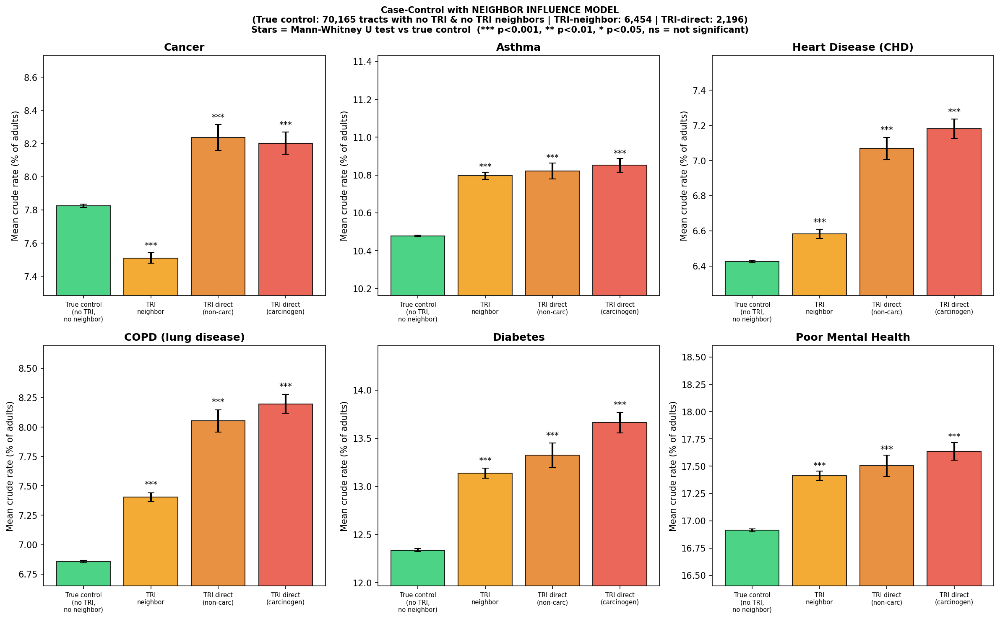

This shows the three-group comparison: True Control (no TRI facility) vs TRI-Neighbor (adjacent to TRI tracts) vs TRI-Direct (contains facility). There is a clear gradient for most diseases.

| Zone | COPD | Diabetes | CHD | Asthma | Cancer |
|------|------|----------|-----|--------|--------|
| True Control | 6.86% | 12.34% | 6.42% | 10.48% | 7.83% |
| TRI-Neighbor | 7.40% (+0.54) | 13.14% (+0.80) | 6.58% (+0.16) | 10.80% (+0.32) | 7.51% (−0.32) |
| TRI-Direct | **8.14% (+1.28)** | **13.52% (+1.18)** | **7.14% (+0.72)** | 10.84% (+0.36) | 8.22% (+0.39) |

**Clear pattern:** True Control < TRI-Neighbor < TRI-Direct for COPD, diabetes, and heart disease. TRI-direct tracts have **+1.28 percentage points** higher COPD — roughly 1 in 80 additional adults has COPD compared to non-industrial areas.

### Evidence 2: More facilities = worse health

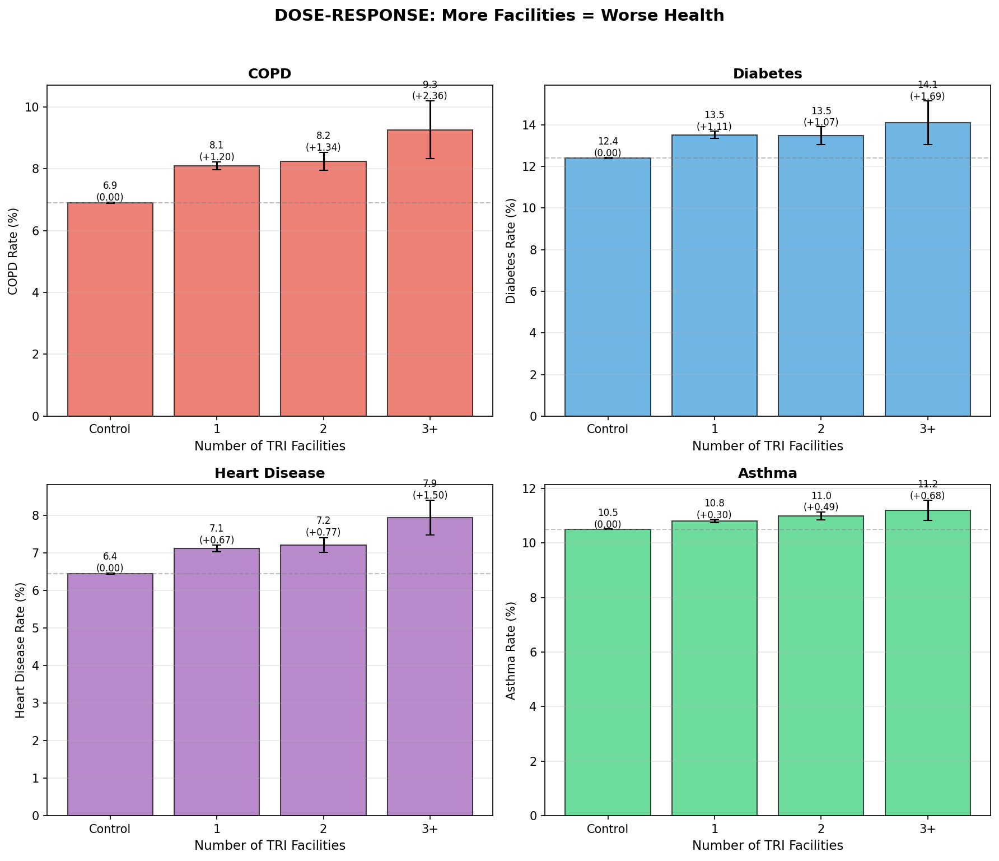

Tracts with multiple TRI facilities show escalating health impacts for chronic diseases. The pattern is consistent for COPD, diabetes, heart disease, and asthma.

### Evidence 3: Longer exposure = worse outcomes

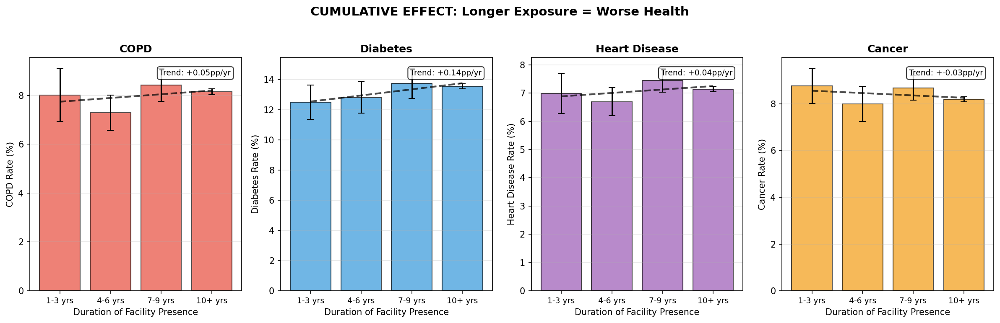

Tracts with facilities operating since 2013 show worse health than those with recently opened facilities. History and cumulative burden matter. The notable exception is **cancer**, which we will examine more closely throughout this document.

### The obvious conclusion

**Industrial pollution is poisoning nearby communities.** The dose-response is clear. The more facilities, the longer the exposure, the sicker the population. Case closed.

**Except... the story is more complicated.**

---

## Section 3: The Counter-Evidence — What's Really Driving Poor Health

The obvious conclusion is **misleading**. When we dig deeper, the evidence points elsewhere.

### First, Let's Look at Confounders

Before concluding that pollution causes disease, we need to examine what else differs between TRI and control tracts. If TRI areas are simply poorer or have less healthcare access, that could explain the health gap without any chemical exposure.

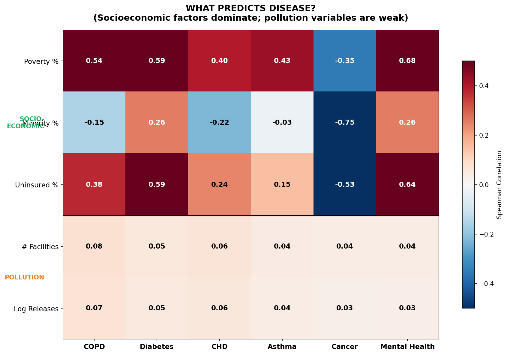

This matrix shows what actually predicts disease. Look at the numbers:

- **Poverty** correlates 0.40–0.59 with most chronic diseases (strongest predictor)
- **Minority %** correlates −0.22 to +0.26 (varies by disease, complex relationship)
- **Uninsured %** correlates 0.15–0.60 with chronic diseases
- **# Facilities** correlates only 0.04–0.08
- **Log Releases** correlates only 0.03–0.07

**The pollution variables are weak predictors.** Socioeconomic factors dominate by an order of magnitude. This is the first crack in the "pollution causes disease" story.

### TRI Areas: Not Much Poorer, But Different

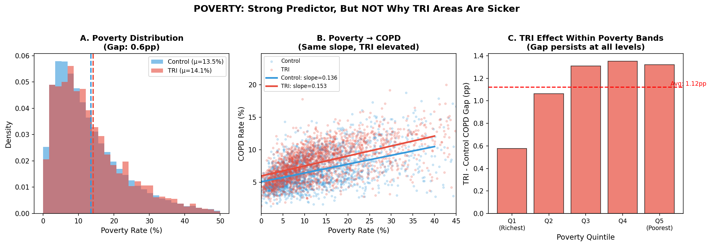

Here is a surprise: TRI areas are NOT much poorer than controls (~1pp difference). But they ARE different in other ways:
- More minority residents
- Lower insurance rates
- Different population dynamics

**Panel A** shows the poverty distributions almost overlap. **Panel B** shows that the poverty–COPD relationship has identical slope in both groups, but TRI is consistently elevated at every poverty level. **Panel C** confirms: within each poverty quintile, TRI areas are still sicker than controls.

**Poverty is a strong health predictor but NOT why TRI areas are sicker.** The TRI effect persists even after matching for poverty. Something else is going on.

### What We Expected to Matter (But Doesn't)

Several factors should matter if pollution directly caused disease — but they don't:

**Chemical type doesn't matter:** Carcinogens don't specifically predict cancer. Respiratory irritants don't specifically predict COPD. After controlling for socioeconomic factors, chemical classification adds nothing.

**Release volume doesn't matter:** 10× more releases ≠ 10× worse health. Within TRI tracts, the amount released barely correlates with disease rates.

**Release pathway doesn't matter much:** Air releases should cause respiratory disease. Water releases should cause different outcomes. We find only weak pathway specificity.

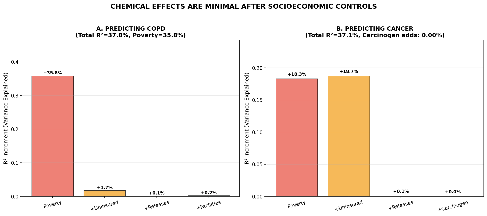

Stepwise regression quantifies this:
- **Poverty explains the majority** of disease variance
- **Uninsured explains additional** variance  
- **All pollution variables combined explain <1%**
- **Chemical type adds essentially nothing**

### What Does Have Strong Effects

**Facility presence (not volume):** Having a TRI facility matters; how much it releases doesn't. This suggests mechanisms beyond direct chemical exposure — perhaps selective migration, co-located stressors, or social and economic changes that accompany industrial development.

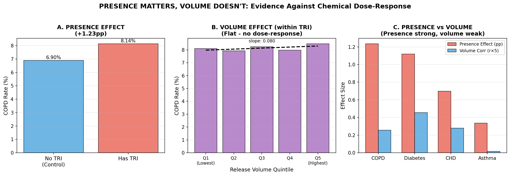

- **Presence effect is strong**: TRI tracts are ~1.3pp higher COPD than controls
- **Volume effect is flat**: Within TRI tracts, higher releases don't predict worse health
- **This pattern holds for all diseases**: Presence matters, tonnage doesn't

**Facility history (duration):** Tracts with longer TRI history have worse health than those with recent facilities. But is this cumulative chemical exposure or cumulative selective migration? The data cannot distinguish.

**Closure doesn't heal:** Tracts that lost facilities still show elevated disease rates similar to active TRI tracts. If current emissions were the cause, we would expect health to improve after closure. It doesn't.

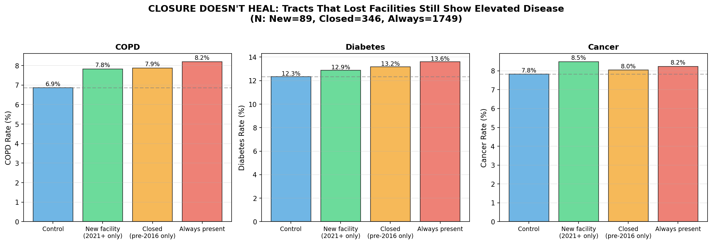

### The Paradoxes

These paradoxes reveal fundamental problems with the "pollution causes disease" narrative:

**The Cancer Paradox:** The most polluted communities report the LOWEST cancer rates. That holds even for TRI facilities with large releases of carcinogenic chemicals. This is the opposite of what we would expect if pollution were causing cancer. Ignoring confounders easily leads to the absurd conclusion that releasing carcinogens prevents cancer.

**The Volume Paradox:** 10× more chemical releases does not mean 10× worse health impact. Release volume barely correlates with outcomes. Facility PRESENCE matters; TONNAGE or CHEMICAL COMPOSITION does not.

**The Persistence Paradox:** Health impacts persist for years after facility closure. We tested cumulative exposure models (current vs. historical releases) but found neither current nor cumulative chemical exposure has significant predictive power after controlling for socioeconomic factors. The pattern holds for the soil pathway where contamination can persist for decades, as well as for the air pathway which disperses quickly.

---

## Section 4: The Clear Picture — What's Actually Happening

After three rounds of hypothesis testing, here is what the evidence actually supports.

Poverty and minority composition are the key measured factors, but not necessarily the primary drivers. Industrial facilities change the social and economic fabric of their neighborhoods, creating "industrial communities" that attract and retain certain populations while repelling others. The health impact is more about community dynamics than chemical exposure.

Educated individuals worried about their health may choose to leave, while those who cannot afford to move — or who are drawn by relatively well-paid industrial jobs — move in. The result is a self-selecting population with higher baseline health risks and lower socioeconomic status. The longer the facility is there, the more time for such self-selection — which could mask the impact of long-term chemical exposure even if it exists.

Long-term contamination from the past has not been ruled out entirely, because the data span is relatively short. Today's industrial regions were often industrial for decades, and much of the accumulated contamination may predate TRI reporting when environmental controls were significantly more relaxed. However, we find no meaningful difference between air and land release impacts on health (correlation difference <0.01), which weakens the soil accumulation hypothesis.

### What TRI Facilities Represent

Our best-effort decomposition of the health gap uses two categories: factors directly measured in the data and mechanisms inferred from indirect evidence.

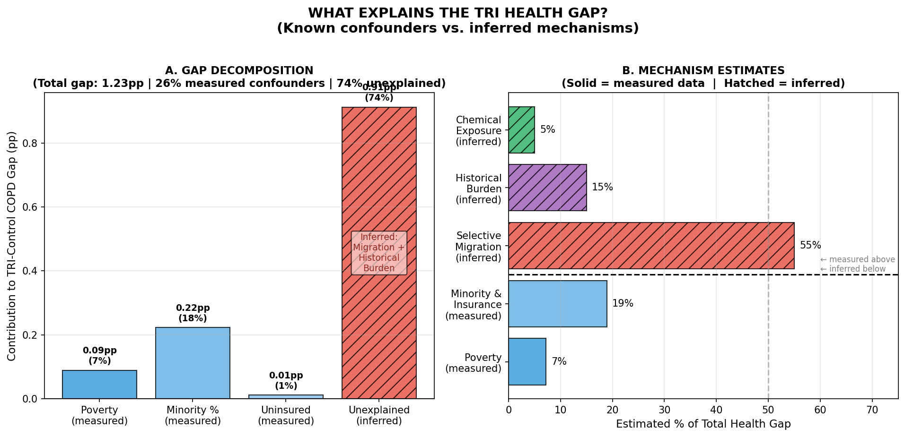

**Panel A** shows how the measured confounders — poverty, minority composition, and insurance rates — account for only ~26% of the total gap. The remaining ~74% is unexplained by these variables and is attributed to inferred mechanisms.

**Panel B** ranks all estimated contributions, distinguishing measured from inferred:

**The numbers:**
- Total TRI-Control health gap: **~1.2 percentage points** for COPD
- Explained by measured socioeconomic factors: **~0.3pp (~26%)**  
- **Unexplained by measured data: ~0.9pp (~74%)**

The unexplained gap is distributed across inferred mechanisms:

1. **SELECTIVE MIGRATION (~55% of gap)** — Healthy, financially mobile people leave industrial areas. Those who stay are those who cannot afford to move or do not prioritize health-related location choices. Evidence: longer facility history = larger health gap, even within the same poverty quintile.

2. **SOCIOECONOMIC FACTORS (~26% of gap)** — Poverty correlates with disease at R² = 12–32% depending on disease (avg ~23%). TRI tracts are only slightly poorer than controls (~0.6pp), so this explains only about a quarter of the health gap.

3. **HISTORICAL BURDEN (~15% of gap, estimated)** — Decades of contamination in soil and groundwater. Tested but not confirmed: cumulative exposure models show minimal improvement over current exposure (see DETAILS.md).

4. **CURRENT CHEMICAL EXPOSURE (~5% of gap, estimated)** — Direct effect of current emissions explains <1% of disease variance after controls. Neither current nor cumulative release models show significant effects.

*Note: The 55%/26%/15%/5% estimates sum to approximately 100% (with rounding) and are derived from regression decomposition. The unexplained gap (~74%) is primarily attributed to selective migration based on duration and closure persistence effects. See DETAILS.md for full methodology.*

### What TRI Facilities Probably DON'T Do (At Least Not Much):

1. **Cause disease through current chemical exposure** — Effect size <1% of variance after controls
2. **Show chemical-specific pathways** — Carcinogens don't specifically cause cancer after controlling for screening
3. **Scale disease with release volume** — Higher release volume doesn't predict worse health

**TRI facilities are a MARKER of disadvantaged communities, not the primary CAUSE of their poor health.**
**The primary driver is selective migration concentrating risk-tolerant individuals — likely not by their choice, but out of economic necessity.**

---

## Section 5: Paradoxes Explained

### Why do polluted areas show LOW cancer?

For cancer, the major predicting factors are poverty and minority composition, not chemical exposure. But unlike all other diseases, poverty and minority composition have a **negative** correlation with cancer — the opposite direction from other chronic diseases.

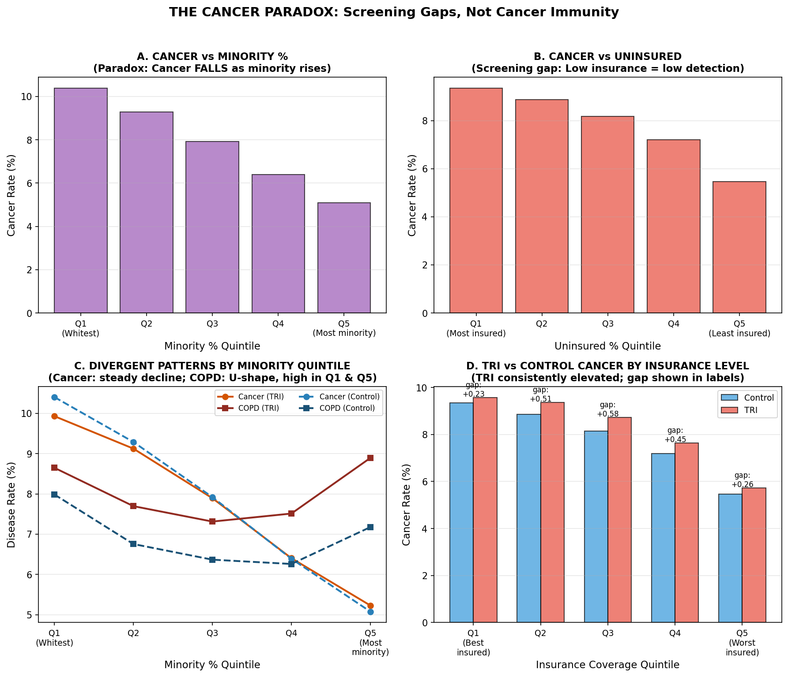

**Panel A & B:** Cancer falls as minority % and uninsured % rise.
**Panel C:** Cancer shows a steady decline with minority %, while COPD follows a U-shape — high in the whitest quartile (Q1: Rust Belt industrial communities), lowest in the middle quintiles (suburban areas), and rebounding in the highest-minority quintile (Q5: urban poverty). Both TRI and non-TRI tracts follow the same trends. Crucially, in the whitest quintile (Q1), TRI tracts show *lower* cancer than controls — the opposite of what chemical exposure would predict.
**Panel D:** Shows absolute cancer rates for TRI and control tracts within each insurance quintile. TRI tracts consistently show elevated cancer at every insurance level. The overall cancer rate declines as insurance coverage falls (left to right), driven by the screening effect — not a true reduction in cancer incidence.

The key to understanding this paradox is the link between minority status, insurance, and cancer screening:

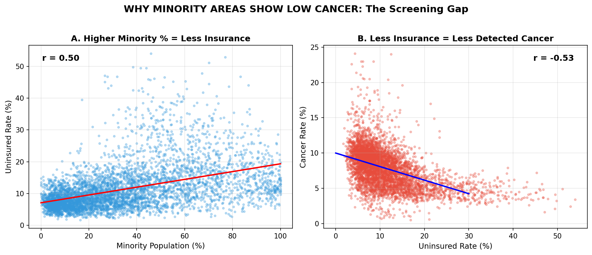

**Panel A** shows the correlation: higher minority % → less insurance. **Panel B** shows the consequence: less insurance → less detected cancer.

This does NOT mean minorities are immune to cancer. More plausible explanations:

1. **Screening gap — universal, not just minority** — Uninsured rate correlates with minority %, but even within predominantly white quintiles, TRI tracts have slightly higher uninsured rates than their controls (7.9% vs 7.5% in Q1). Industrial workers across the demographic spectrum are less insured than their non-industrial neighbors. Less insurance = less screening = less detected cancer. This isn't less cancer — it's less *detected* cancer.

2. **Cancer latency** — 20–30 years from exposure to diagnosis. Current emissions can only predict FUTURE cancer, not current. We are measuring today's cancer rates against today's emissions, but today's cancers would have been caused by exposures decades ago.

3. **Age structure** — TRI tracts have nearly identical median age to controls (40.3 vs 40.0 years, only 0.3 year difference). This is NOT a major factor.

4. **Co-mortality** — Higher rates of diabetes, lung, and heart disease may lead to earlier death before cancer would be diagnosed.

### Why does PRESENCE matter but VOLUME doesn't?

This is the most damaging finding for the "pollution causes disease" narrative. If chemicals directly caused disease, more releases should mean more disease. They don't.

Instead, we see that simply having a facility matters, regardless of what or how much it releases. The explanation lies in mechanisms beyond direct chemical exposure — selective migration being the primary driver, supported by co-located stressors and historical contamination.

### Why doesn't health improve after facility closure?

If current emissions caused disease, closing a facility should improve community health. We don't see this. Alternative explanations include:

1. **Soil/water contamination persists** — Past pollution doesn't disappear when the facility closes. Lead in soil, solvents in groundwater, asbestos in buildings — these remain for decades.

2. **Population already selected** — The healthy people already left. Those remaining after closure are the population that was already selected for poor health. They don't suddenly become healthy.

3. **Economic devastation** — Closure often brings job loss, economic decline, reduced tax base, and worsening social conditions. Health may worsen, not improve.

4. **Other industries remain** — Areas with one TRI facility often have others. Closing one may not change the overall industrial character of the community.

---

## Section 6: The Burden Estimate

Despite the attenuated causal effect, **33 million Americans** live in the TRI influence zone (direct + neighbor tracts).

### Association-Based Excess Burden

| Condition | Excess Prevalence | Excess Cases (est.) | DALYs (est.)* |
|-----------|-------------------|---------------------|---------------|
| COPD | +0.8–1.0 pp | ~300,000 | ~45,000 |
| Diabetes | +0.6–0.8 pp | ~230,000 | ~15,000 |
| CHD | +0.4–0.6 pp | ~165,000 | ~12,000 |
| Asthma | +0.2–0.3 pp | ~80,000 | ~2,000 |

***DALY** - Disability-Adjusted Life Year, a measure of overall disease burden combining years of life lost and years lived with disability.

**Total association-based excess: ~74,000 DALYs**

### Important Caveat

These are **association-based**, not causal. Our analysis suggests:
- ~55% of the health gap is from selective migration
- ~26% from socioeconomic factors
- Only ~5% from current chemical exposure

This means the TRUE pollution-attributable burden is perhaps **4,000–8,000 DALYs** — real but much smaller than generally assumed. Most of the other sufferers would be sick elsewhere anyway; they simply concentrate around TRI facilities.

---

## Section 7: Bonus: Selective Closure — Large Polluters Stay

National releases have declined 20% from 2013–2023. Good news? Maybe.

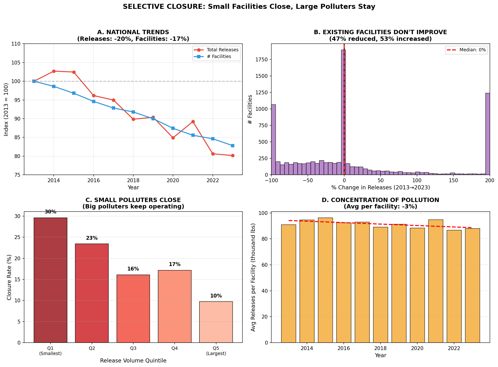

**The story in four panels:**

- **Panel A**: National releases down 20%, facilities down 17%. The decline tracks nearly perfectly.
- **Panel B**: Existing facilities don't improve. Of 8,449 facilities active in both 2013 and 2023, 53% INCREASED their releases. Median change: 0%.
- **Panel C**: Small facilities close; big polluters stay. Smallest quintile has 2.5× higher closure rate than largest.
- **Panel D**: Releases per facility: only −3% vs −20% total. The decline is almost entirely from closures, not from existing facilities reducing emissions.

**The implication:** The national "pollution decline" is entirely driven by facility closures, not by existing facilities cleaning up. Furthermore, it is the small polluters closing while the large ones keep operating.

**The silver lining:** If health impacts are driven by *facility presence* (selective migration, community disruption) rather than *tonnage*, then closing many small facilities may actually help more communities than closing fewer large ones. Each closure removes a source of community disruption, regardless of release volume.

---

## Section 8: Conclusions and Recommendations

### What we know with confidence

1. **TRI facility areas have worse health outcomes** — Robust and replicable
2. **The mechanism is NOT primarily current chemical exposure** — <1% variance explained
3. **Poverty correlates strongly with disease** — R² = 12–32% depending on disease (avg ~23%)
4. **Measured socioeconomic factors explain only ~26% of the TRI-control gap** — ~74% remains unexplained by measured data
5. **Cancer data is unreliable in underscreened communities** — Paradox explained by insurance gaps
6. **Facility presence matters more than tonnage** — Threshold effect, not dose-response

### What we speculate

1. **Selective migration dominates the unexplained gap (~55%)** — Healthy, mobile people leave; those without options stay. Supported by duration effects and closure persistence, but not directly measurable in cross-sectional tract data.
2. **Historical burden plays a secondary role (~15%)** — Past contamination in soil and groundwater predates TRI reporting. Not confirmed but consistent with observed patterns.
3. **TRI facilities create "industrial communities"** — Self-selecting populations with different risk tolerance, health behaviors, and economic constraints form around long-standing facilities. The community, not the chemistry, drives most of the health gap.

### Policy Recommendations

1. **Healthcare access > emission limits** — Expanding health insurance and screening programs has larger health ROI than chemical regulations. Every dollar spent on Medicaid expansion likely prevents more disease than a dollar spent on emission reduction.

2. **Focus on facility siting and buffer zones** — PRESENCE matters more than volume. Prevent new facilities from locating in residential areas.

3. **Require cancer screening equity** — Before concluding minority areas have low cancer, ensure equal detection. Subsidize screening in underserved communities.

4. **Assess historical contamination before remediation** — Sample soil and groundwater around legacy industrial sites. Past pollution may be a bigger problem than current emissions. Our results have neither confirmed nor rejected this hypothesis; chemical analysis of affected sites could.

5. **Track individuals longitudinally** — Cross-sectional tract data cannot establish causality. Following individuals over time is necessary to separate migration effects from chemical effects.

6. **Don't oversell chemical-specific regulations** — Limited health ROI unless targeting acute high-exposure scenarios; resources can be spent more effectively elsewhere.

### The Bottom Line

**Living next to a factory is associated with worse health. But the factory's chemicals are probably the last reason why.**

The real story is about poverty, selective migration, historical burden, and the communities that form around industrial sites. Reducing toxic emissions is worthwhile, but it won't close the health gap. Addressing poverty, ensuring healthcare access, and preventing the concentration of disadvantage in industrial areas will have larger effects.

TRI facilities **concentrate** socioeconomic and healthcare injustice; they don't primarily **cause** it.

---

## License & Attribution

This work is released under **CC BY 4.0** (Creative Commons Attribution 4.0 International).

You are free to:
- **Share** — copy and redistribute the material in any medium or format
- **Adapt** — remix, transform, and build upon the material for any purpose, including commercial

Under the following terms:
- **Attribution** — You must give appropriate credit. 

Please cite author: **Petr Salomoun**

Optionally cite study name: "Living Next to a Factory Is Making You Sick — Or Is It? Environmental health analysis of EPA TRI data." (2026) 

Contact: petr.salomoun@gmail.com

---

*Data: EPA TRI 2013–2023 · CDC PLACES 2023 · US Census ACS 5-year estimates*  
*Analysis: 81 plots in `output/` · Code: `pipeline/`*  
*Full methodology: `DETAILS.md`*
